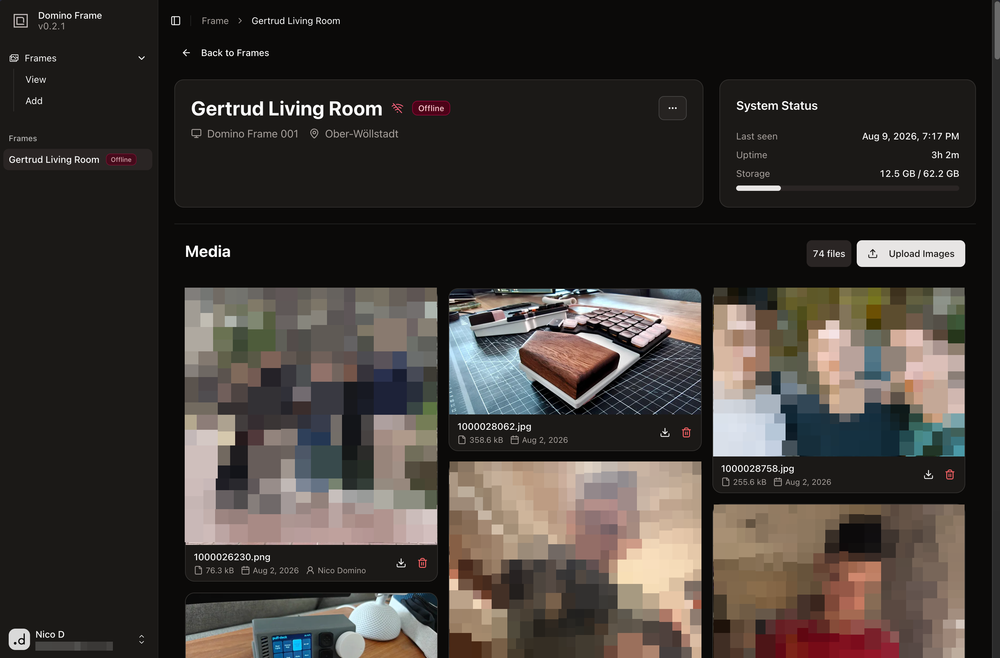
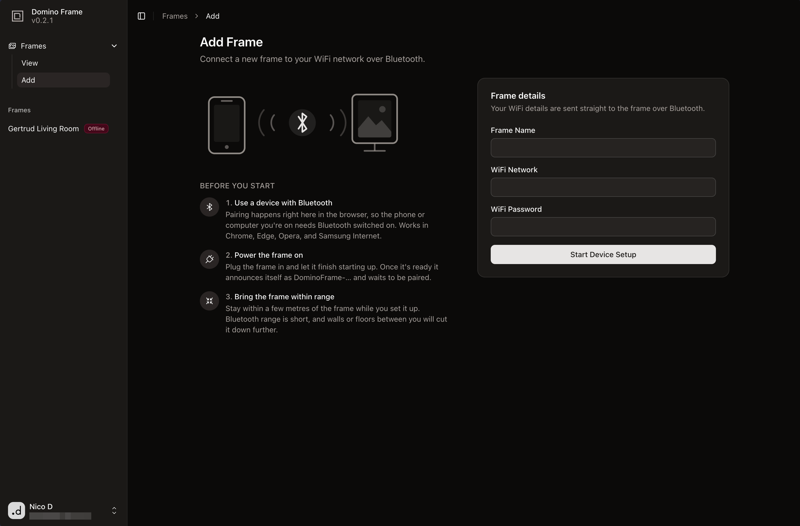

# 🖼️ Domino Frame Web

The web admin portal for [Domino Frame](https://github.com/ndom91/domino-frame), a self-hosted digital photo-frame system.

## Features

- Provision a new frame over Bluetooth Low Energy with its name, Wi-Fi credentials, and a per-frame API key.
- Track heartbeat-based frame status, including host uptime, storage capacity, last seen time, and the active image.
- Search, filter, and remove frames from the portal.
- Upload, preview, download, and delete images for each frame.
- Media is stored in any S3 compatible object store under the frame's ID.
- Limit portal and media access to authenticated users with access to the frame.
- Sign in with GitHub, Google, or a passkey.
- Install the web app on a phone as a standalone progressive web app.

## Screenshots





## Development

Copy the environment template, add the required authentication, Turso, and Cloudflare R2 values, then start the app:

```bash
cp .env.example .env
pnpm install
pnpm db:push
pnpm dev
```

Open [http://localhost:3000](http://localhost:3000).

`pnpm db:push` applies additive schema changes to the configured Turso database. The deployed portal must use HTTPS for frame provisioning and telemetry.

## License

MIT
